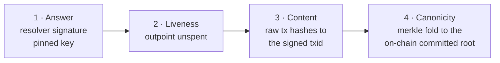

# ORDnet-web3names

[](https://github.com/ORDNET/ORDnet-web3names/actions/workflows/test.yml)
[](#tests)
[](#files)
[](https://github.com/ORDNET/ODNCA-standards)
[](LICENSE)

Verified on-chain name resolution for browsers and wallets: type
`earthlog.web3` (or pay `info@earthlog.web3`) and land on the name's
on-chain site — with every answer independently verified, never trusted.

This is the module behind the `.web3` integration proposed to BSV Browser in
[bsv-blockchain/bsv-browser#114](https://github.com/bsv-blockchain/bsv-browser/pull/114).
It is published here as a standalone, reusable package for any browser,
wallet, or application that wants to support web3 names.

- **Zero runtime dependencies.** Plain TypeScript; crypto arrives through a
  small `CryptoDeps` adapter (an `@bsv/sdk` adapter is included, any
  sha256 + secp256k1 implementation works).
- **Standards-based.** Implements [ODNCA-STD-001](https://odnca.org)
  (resolution & signed answers), STD-005 (URI schemes) and STD-006
  (content channel). Full standards: https://github.com/ORDNET/ODNCA-standards
- **Verified, not trusted.** The frozen STD-001 §7.1 conformance vector is
  reproduced bit-exact in the test suite.

## Trust model — "don't trust us, recompute us"



| Layer | What is checked | Enforced in |
|---|---|---|
| 1. Answer | resolver signature (STD-001 §7), fixed-field preimage, pinned key | `verify.ts` |
| 2. Liveness | `current.txid:vout` unspent | `liveness.ts` ('unknown' proceeds on the signed, short-lived answer) |
| 3. Content | raw tx double-SHA256 equals the signed txid | `ordContent.ts` |
| 4. Canonicity | merkle inclusion against the on-chain committed root | see [ODNCA-verify](https://github.com/ORDNET/ODNCA-verify) |

The resolver endpoint is **configuration, not trust**: any conformant
operator works, the default is `sns.ordnet.io`, and a lying or compromised
source fails checks 1–3 in this module. The published ruleset and vectors
let anyone re-derive the same namespace from the chain.

## Integration (two lines in the address bar)

```ts
import { classifyAddressInput } from './src'

const hit = classifyAddressInput(input)
if (hit.kind === 'web3') return navigateToWeb3(hit) // else: existing URL/search path
```

`navigateToWeb3` = `resolveName` → `verifyAnswer` → `fetchVerifiedContent`
→ render (see [WIRING.md](WIRING.md) for the full snippet, written for
BSV Browser but portable to any WebView-based host). Classification is
conservative: only inputs that parse as `name.tld` with a TLD in the
recognised set are intercepted — `example.com`, search phrases, and every
normal URL pass through untouched.

## Files

- `src/names.ts` — address parsing/normalization (STD-001 §4; non-ASCII = exact bytes)
- `src/tlds.ts` — built-in TLD snapshot + live refresh from resolver `/health` (TLD allowlist per v1.2.0: a refresh can confirm or retire shipped TLDs, never add or remove — plus shape guards)
- `src/resolve.ts` — one-GET transport to any conformant resolver
- `src/verify.ts` — the signature scheme; frozen conformance vector reproduced in tests
- `src/liveness.ts` — the unspent check (STD-001 verification level 3)
- `src/ordContent.ts` — txid-anchored raw-tx fetch + 1Sat ord envelope parsing (single body push per the 1Sat spec)
- `src/addressBar.ts` — the conservative omnibox classifier
- `src/render.ts` — data-URI rendering, honest error/too-large pages, size cap
- `src/openWeb3Site.ts` — the assembled navigation flow
- `src/adapters.ts` — `CryptoDeps` via `@bsv/sdk` (the only file that references a dependency)

## Tests

```bash
npm install   # dev-only: tsx
npm test
# -> RESULT: 45 passed, 0 failed
```

45 unit tests, running on bare Node through the zero-dependency harness in
`test/run.ts` — including the frozen STD-001 sighash vector and the 1Sat
envelope rules.

## License

MIT © ORDnet / ODNCA
